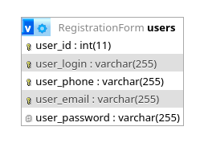

# Форма авторизации
Ссылка на сайт: [https://trolleyfun.h1n.ru/](https://trolleyfun.h1n.ru/)
## Цели проекта
Проект демонстрирует умение создавать веб-сайты, используя язык PHP, а также навыки подключения к сайту внешних модулей (API).
## Используемые технологии
HTML, CSS, PHP, SQL
## Внешние модули (API)
При разработке веб-сайта использовалась [Yandex Smart Captcha](https://yandex.cloud/ru/services/smartcaptcha).
## Запуск проекта на своем сервере
1. Разместите файлы проекта в корневом каталоге на своем сервере;
2. Создайте базу данных;
3. Укажите параметры базы данных (адрес сервера, логин и пароль пользователя, имя базы данных) в файле includes/db.php;
4. Инициализируйте базу данных, используя скрипт "db/db_script.sql";
5. После настройки базы данных удалите директорию "db" с сервера;
6. Создайте Yandex Smart Captcha;
7. Укажите значения ключей сервера и клиента Yandex Smart Captcha в файле "includes/functions.php";
8. Для демонстрации работы проекта доступны три пользователя со следующими данными для входа:
    + телефон: +79991111111, пароль: 111
    + телефон: +79992222222, пароль: 222
    + телефон: +79993333333, пароль: 333
## Структура базы данных
База данных состоит из одной таблицы.

+ первичный ключ: **user_id**
+ столбцы со свойством UNIQUE: **user_login**, **user_phone**, **user_email**
## Описание сайта
Сайт состоит из трех страниц.
### Главная страница
Для авторизованных пользователей на этой странице отображается приветственное сообщение.

Для неавторизованных пользователей на странице размещена форма авторизации. Необходимо ввести номер телефона или e-mail, указанные при регистрации, (в одном поле), пароль, а также решить **Yandex Smart Captcha**.
### Страница регистрации
Страница доступна только неавторизованным пользователям. В этом разделе находится форма регистрации, состоящая из 5 полей: логин, номер телефона, e-mail, пароль, повторение пароля. Ниже расположена **Yandex Smart Captcha**.

Введенные пользователем данные должны соответствовать следующим требованиям:
+ поля не могут быть пустыми;
+ поле "Номер телефона" должно содержать корректный номер телефона и соответствовать формату +79991234567 (начинается с "+7", далее идут 10 цифр);
+ поле "E-mail" должно содержать корректный e-mail;
+ логин, номер телефона и e-mail пользователя не могут совпадать с соответствующими данными ранее зарегестрированных пользователей;
+ пароль и повтор пароля должны совпадать;
+ должна быть правильно решена **Yandex Smart Captcha**.

При успешной регистрации происходит автоматическая авторизация пользователя.
### Страница профиля
Страница доступна только авторизованным пользователям.

Пользователь может отредактировать свои личные данные: логин, номер телефона, e-mail и пароль. Для изменения логина, номера телефона и e-mail подтвержение паролем не требуется. При изменении пароля необходимо ввести текущий пароль и повтор нового пароля.

Требования к введенным пользователем данным такие же, как и при регистрации.
### Навигационное меню
Навигационное меню расположено в верхней части сайта. Для неавторизованных пользователей оно состоит из двух пунктов: "Вход" и "Регистрация". Для авторизованных пользователей оно состоит из пунктов "Главная", "Профиль" и "Выйти".
### Информационные сообщения
При некорректных данных, введенных пользователем, а также при успешном изменении личных данных пользователя отображается информационное сообщение.
## Дизайн сайта 
При верстке сайта использовались **HTML** и **CSS**. Сайт имеет отзывчивый дизайн. Были проанализированы наиболее популярные разрешения экрана (ширина) устройств пользователей:
+ мобильные устройства: 360px, 393px, 414px
+ планшеты: 600px
+ ПК: от 1280px до 1920px
## Корректность входных данных
Все данные, введенные пользователем, проходят проверку на корректность на стороне клиента и на стороне сервера.
## Безопасность
+ для предотвращения SQL-инъекций во всех входных данных производится экранирование специальных символов;
+ чтобы избежать ошибок при запросах к базе данных, все входные данные проходят проверку на корректность;
+ к паролям, хранящимся в базе данных, применяется хэширование по алгоритму Blowfish;
+ страница профиля доступна только для авторизованных пользователей.
## Планы по улучшению проекта
+ реализовать подтверждение номера телефона и e-mail пользователей;
+ хранить данные для соединения с базой данных и ключи сервера и клиента **Yandex Smart Captcha** в переменных окружения;
+ ввести более строгие требования к паролям пользователей.
